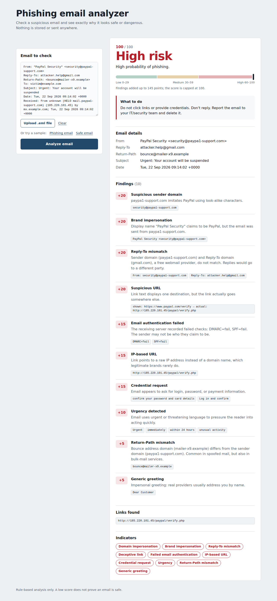
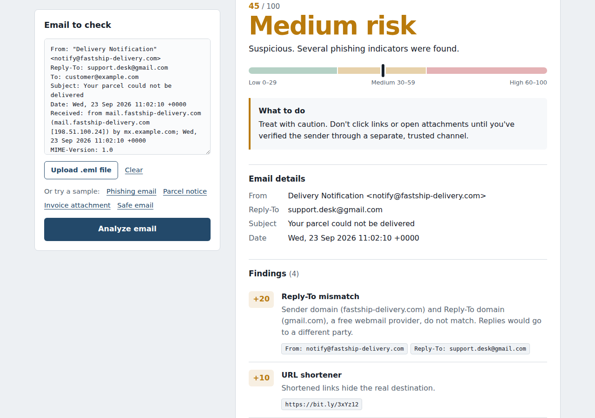
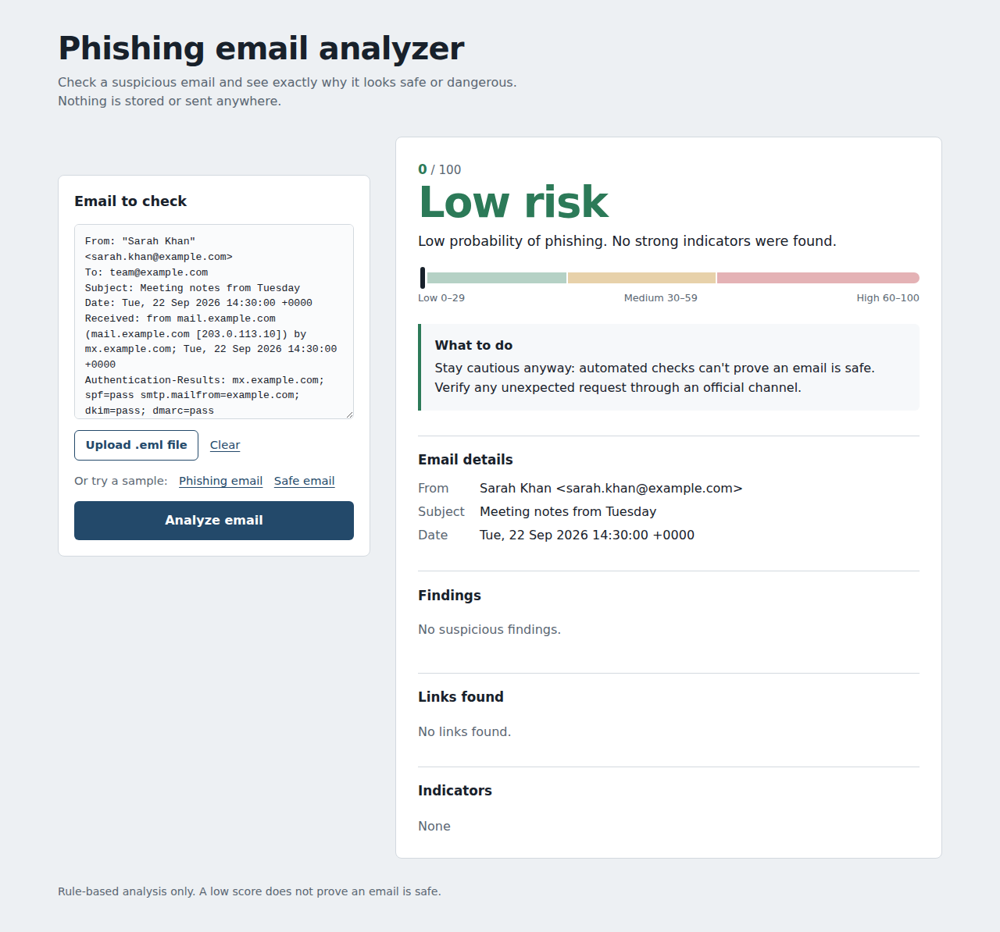

# 🛡️ Phishing Email Analyzer

<p align="center">
  <strong>A lightweight, explainable, rule-based phishing email detection tool</strong><br>
  Analyze email headers, URLs, content, attachments, and authentication indicators — then get a transparent risk score with the evidence behind it.
</p>

<p align="center">
  
</p>

<p align="center">
  
  
  
  
  
</p>

---

## 📌 Overview

**Phishing Email Analyzer** is a security-focused email analysis tool designed to help identify common phishing indicators without opening links, executing attachments, or sending analyzed content to external services.

The analyzer accepts **`.eml` files, `.txt` files, or pasted raw email content**, extracts relevant indicators, applies explainable detection rules, and produces a risk score from **0–100**.

Instead of simply returning *“Phishing: Yes/No”*, the tool explains **why** an email was considered suspicious.

---


## 📁 Project Structure

```text
phishing-email-analyzer/
│
├── app/
│   ├── analyzer/
│   │   ├── content_analyzer.py
│   │   ├── email_parser.py
│   │   ├── header_analyzer.py
│   │   ├── risk_engine.py
│   │   └── url_analyzer.py
│   │
│   ├── utils/
│   │   ├── helpers.py
│   │   └── validators.py
│   │
│   ├── templates/
│   │   └── index.html
│   │
│   └── main.py
│
├── samples/
│   ├── suspicious_email.eml
│   ├── invoice_attachment.eml
│   ├── parcel_notice.eml
│   └── safe_email.eml
│
├── screenshots/
│   ├── ui_high_risk.png
│   ├── ui_medium_risk.png
│   ├── ui_low_risk.png
│   └── ui_mobile.png
│
├── tests/
├── static/
├── requirements.txt
├── LICENSE
└── README.md
```
---

### What it analyzes

- ✉️ Sender and email headers
- ↩️ Reply-To and Return-Path mismatches
- 🔐 SPF / DKIM / DMARC authentication results
- 🔗 URLs and deceptive links
- 🌐 IP-based URLs and URL shorteners
- 🪪 Lookalike / impersonated domains
- ⚠️ Urgency, threats, and credential requests
- 📎 Suspicious attachment names
- 🧾 Generic greetings and other content indicators

---

## ✨ Features

### 🔍 Explainable Phishing Detection

Every finding contributes to a transparent score and is accompanied by evidence, making the result easier to understand and investigate.

### 📧 Multiple Input Methods

Analyze:

- `.eml` email files
- `.txt` email files
- Raw email text pasted directly into the web interface
- CLI input
- API uploads

### 🧩 Header Analysis

Detects indicators such as:

- Suspicious sender domains
- Brand impersonation
- Reply-To mismatches
- Return-Path mismatches
- Failed SPF, DKIM, or DMARC results reported by the email headers

### 🔗 URL Analysis

Checks for:

- Raw IP address links
- Deceptive link text
- Lookalike domains
- URL shorteners
- `user@host` URL tricks

### 📝 Content Analysis

Looks for:

- Urgency and deadline pressure
- Threatening language
- Credential/password requests
- Generic greetings
- Suspicious attachment names such as `Invoice.pdf.exe`

### 📊 Risk Scoring

The risk engine combines weighted indicators into a score from **0 to 100** and returns:

| Score | Risk Level |
|---:|---|
| `0–29` | 🟢 LOW |
| `30–59` | 🟡 MEDIUM |
| `60–100` | 🔴 HIGH |

The final score is capped at 100, and each finding type is counted once so repeated links or keywords cannot artificially inflate the score.

### 🖥️ Web UI + CLI + API

Use the analyzer through:

- A browser-based Flask interface
- Command line
- JSON output
- HTTP API

### 🧪 Automated Test Suite

The project includes **53 automated tests** covering parsing, detection logic, URL analysis, risk scoring, sample emails, and web behavior.

---

## ⚙️ How It Works

```text
                    ┌──────────────────┐
                    │  Email Input     │
                    │ .eml / .txt /    │
                    │ pasted email     │
                    └────────┬─────────┘
                             │
                             ▼
                    ┌──────────────────┐
                    │  Email Parser    │
                    └────────┬─────────┘
                             │
             ┌───────────────┼───────────────┐
             ▼               ▼               ▼
      ┌────────────┐  ┌────────────┐  ┌────────────┐
      │   Header   │  │    URL     │  │  Content   │
      │  Analysis  │  │  Analysis  │  │  Analysis  │
      └──────┬─────┘  └──────┬─────┘  └──────┬─────┘
             │               │               │
             └───────────────┼───────────────┘
                             ▼
                    ┌──────────────────┐
                    │   Risk Engine    │
                    └────────┬─────────┘
                             ▼
                    ┌──────────────────┐
                    │ Score + Findings │
                    │ + Recommendation │
                    └──────────────────┘
```

### Core Modules

| Module | Responsibility |
|---|---|
| `app/analyzer/email_parser.py` | Parses `.eml` / raw email text into a structured representation |
| `app/analyzer/header_analyzer.py` | Analyzes sender, Reply-To, Return-Path, and authentication indicators |
| `app/analyzer/url_analyzer.py` | Extracts and analyzes URLs from email content |
| `app/analyzer/content_analyzer.py` | Detects suspicious language, credential requests, greetings, and attachments |
| `app/analyzer/risk_engine.py` | Calculates the weighted risk score and final classification |
| `app/utils/validators.py` | Validates web input, file type, and size limits |
| `app/main.py` | CLI entry point, Flask application, and API endpoint |

---

## 📊 Detection & Scoring Model

| Indicator | Weight |
|---|---:|
| Suspicious sender domain | +20 |
| Brand impersonation | +20 |
| Reply-To mismatch | +20 |
| Suspicious URL / deceptive link / lookalike domain | +20 |
| Credential request | +15 |
| Risky attachment | +15 |
| IP-based URL | +15 |
| Failed SPF / DKIM / DMARC | +15 |
| Urgent language | +10 |
| URL shortener | +10 |
| Return-Path mismatch | +5 |
| Generic greeting | +5 |

> **Note:** These are heuristic weights, not a probability of compromise. A risk score is an indicator for investigation, not proof that an email is malicious or safe.

---

## 🚀 Quick Start

### 1. Clone the repository

```bash
git clone <your-repository-url>
cd phishing-email-analyzer
```

### 2. Create a virtual environment

**Linux / macOS**

```bash
python3 -m venv .venv
source .venv/bin/activate
```

**Windows**

```powershell
python -m venv .venv
.venv\Scripts\activate
```

### 3. Install dependencies

```bash
pip install -r requirements.txt
```

### 4. Start the web application

```bash
python -m app.main --web
```

Open:

```text
http://127.0.0.1:5000
```

---

## 📧 Analyze Your Own Email

You can test the analyzer with an email you own by exporting it as an `.eml` file or by pasting the raw email content into the web interface.

### CLI

```bash
python -m app.main samples/suspicious_email.eml
```

JSON output:

```bash
python -m app.main samples/suspicious_email.eml --json
```

### Web UI

1. Start the application.
2. Open `http://127.0.0.1:5000`.
3. Upload an `.eml` / `.txt` file or paste the email content.
4. Click **Scan Email**.
5. Review the risk score and individual findings.

### API

```bash
curl -F "file=@samples/suspicious_email.eml" \
  http://127.0.0.1:5000/analyze
```

---

## 🧪 Sample Results

The repository includes safe and intentionally suspicious **test samples** for development and validation.

| Sample | Demonstrates | Score | Level |
|---|---|---:|---|
| `suspicious_email.eml` | Lookalike domain, Reply-To mismatch, deceptive/IP URL, credential request | 100 | 🔴 HIGH |
| `invoice_attachment.eml` | Suspicious sender, failed authentication results, risky attachment name | 70 | 🔴 HIGH |
| `parcel_notice.eml` | Reply-To mismatch, shortened URL, deadline pressure | 45 | 🟡 MEDIUM |
| `safe_email.eml` | Ordinary internal email | 0 | 🟢 LOW |

<p align="center">
  
  
</p>

---

## 🧪 Testing

Run the complete test suite:

```bash
python -m pytest -v
```

The project currently contains **53 automated tests**.

Run focused test modules when troubleshooting a specific component:

```bash
python -m pytest tests/test_email_parser.py -v
python -m pytest tests/test_detectors.py -v
python -m pytest tests/test_url_analyzer.py -v
python -m pytest tests/test_risk_engine.py -v
python -m pytest tests/test_web.py -v
python -m pytest tests/test_samples.py -v
```

---

## 🔐 Security & Privacy

Security and privacy are core design considerations of this project.

- Emails are analyzed as **untrusted input**.
- Email content is rendered using safe text handling in the web interface.
- Only `.eml` / `.txt` uploads are accepted.
- Upload size is limited to 2 MB.
- Sample file names are controlled to prevent path traversal.
- Content Security Policy and `nosniff` security headers are enabled.
- Nothing is intentionally stored or sent to third-party services.
- Email attachments are **not executed**.
- URLs are **not opened or fetched** during analysis.
- Analysis is performed statically on the supplied email content.

> **Important:** Do not treat a LOW score as proof that an email is safe. This tool is a defensive analysis aid and should be combined with normal security practices and human review.

---

## ⚠️ Limitations

This project is intentionally lightweight and rule-based.

- No machine-learning model is used.
- No live threat-intelligence or reputation lookups are performed.
- The brand detection list is limited.
- Current keyword patterns are primarily English-language.
- SPF/DKIM/DMARC values are read from the email's `Authentication-Results` header; they are not independently verified against DNS.
- Legitimate services can sometimes trigger individual heuristics.
- Detection rules can produce false positives or false negatives.

---


## 👨‍💻 Developers

### Noor Fatima  — `https://github.com/noor-fatima32`

**Developer / Security Researcher**

### Hadi Faheem — `CyberReaper_1`

**Developer / Cybersecurity Contributor**

---
